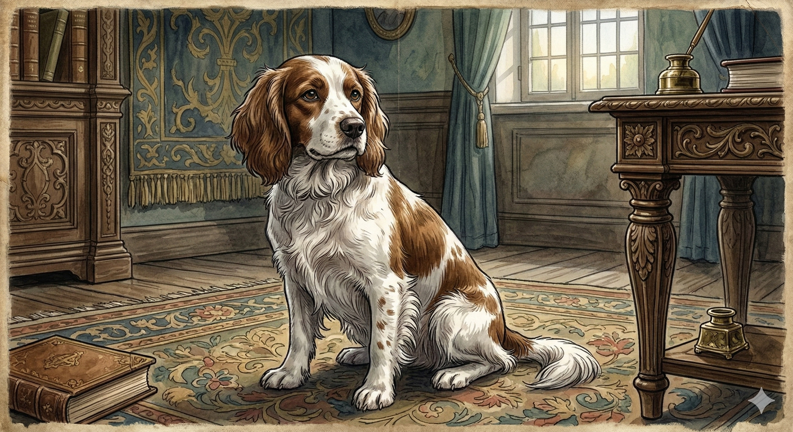
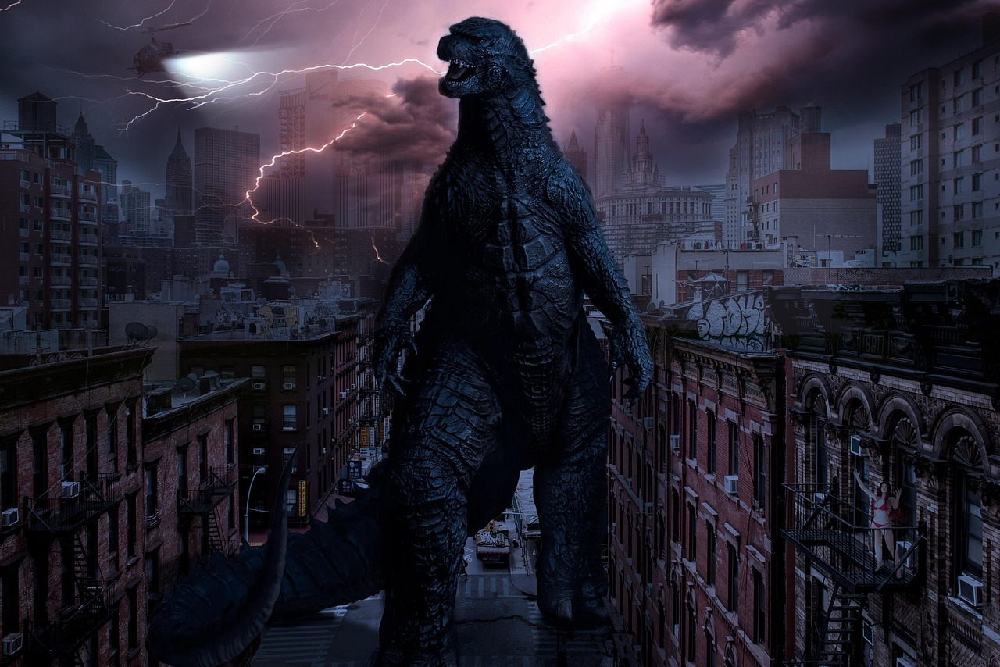
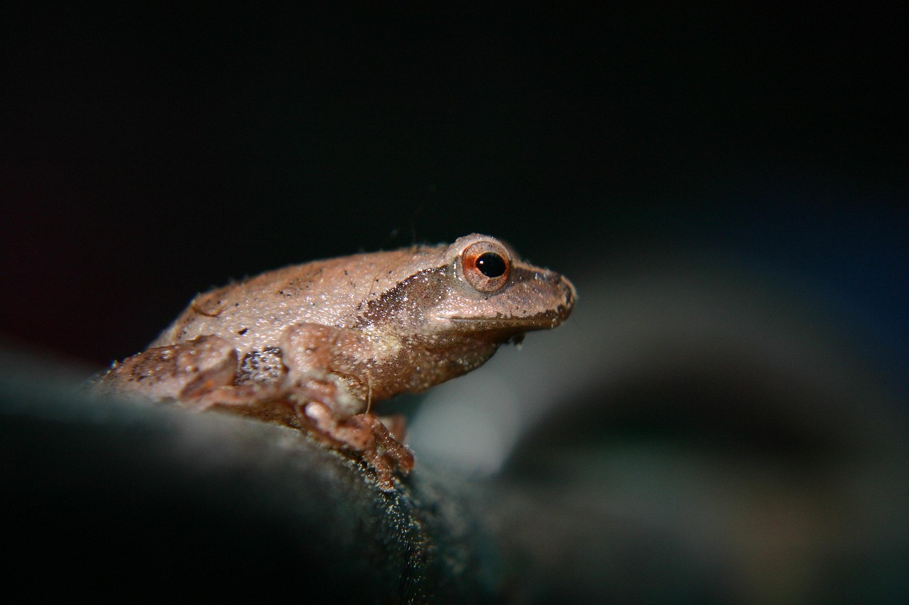
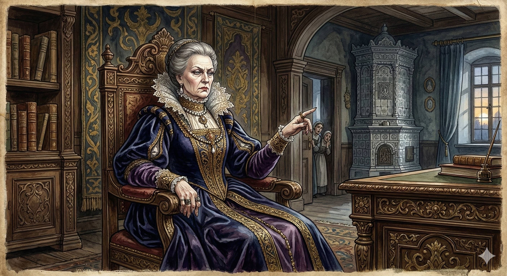
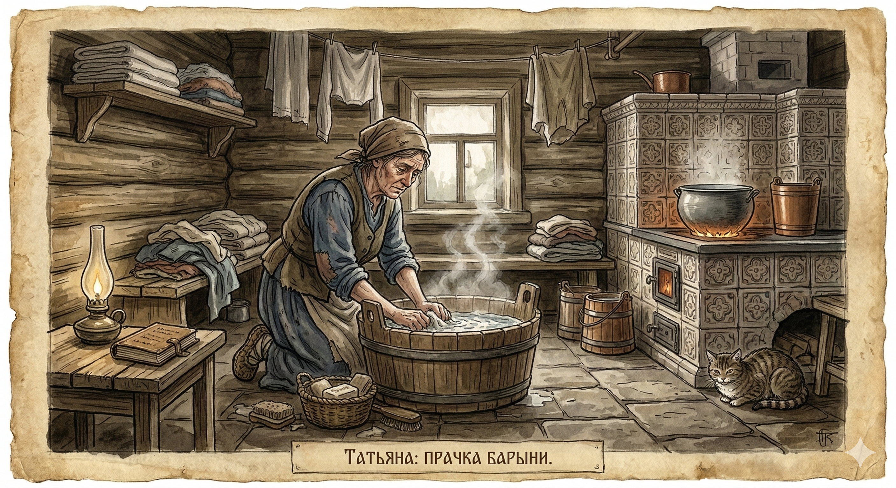
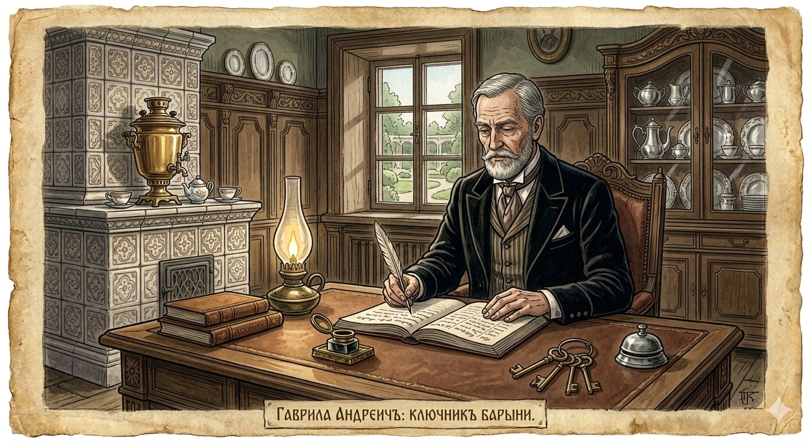
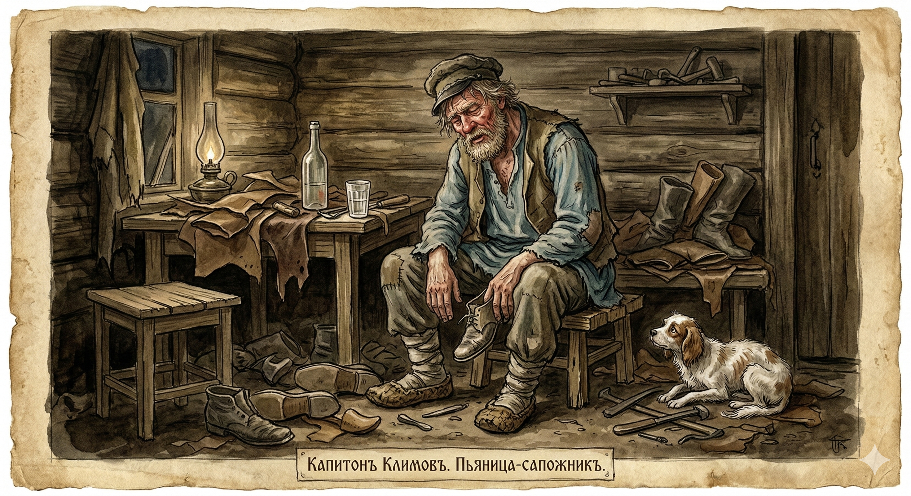

# SLIDE 1
<!-- .slide: data-background-video="images/russia_clipped.mp4" data-background-video-loop data-background-video-muted -->

<slide-title 
    title="Welcome to Russia" 
    subtitle="Reading a story that makes every Russian kid cry" 
    badge="MUMU: LESSON 1">
    
</slide-title>

Notes:
Welcome students to the first lesson of the summer course. Use the video to set the scene of Imperial Russia.

# SLIDE 2
<!-- .slide: class="impact-layout" data-background-color="#050811" -->

    

        Today, we start a famous Russian story:  
        'Mumu'.
    

    

Notes:
Introduce the title of the story. The dog is the emotional core of the lesson.

# SLIDE 3
<!-- .slide: data-background-video="images/mission_teens_clipped.mp4" data-background-video-loop data-background-video-muted -->

<h1 style="color: white; text-shadow: 2px 2px 15px black;">YOUR MISSION</h1>

    

        <i class="fas fa-landmark"></i>
        See life in old Russia
    

    

        <i class="fas fa-pen-fancy"></i>
        Write your first story
    

    

        <i class="fas fa-dog"></i>
        Guess what happens to Mumu
    

Notes:
Go through the objectives. Focus on the creative writing and the narrative hook.

# SLIDE 4
<!-- .slide: class="schema-activation" -->

<slide-task title="Welcome to Summer School!">
    
Take a moment to tell us who you are, and what Grade 7 was like ...

    

        <i class="fas fa-sun"></i>
        <i class="fas fa-umbrella-beach"></i>
        <i class="fas fa-ice-cream"></i>
    

</slide-task>

Notes:
Brief icebreaker. Let students share a quick sentence about themselves and their year so far.

# SLIDE 5
<!-- .slide: data-background-color="#556b2f" -->

<slide-task title="Task 1: The Giant & The Frog" badge="TASK 1" timer="12">
    
Write a short story about a **Giant** and a **Frog**. (Aim for about 75 words).

    

        
        
    

</slide-task>

Notes:
Diagnostic writing task. Monitor their grammar and sentence structure secretly while they write.

# SLIDE 6
<!-- .slide: class="impact-layout" -->

    

        We are going to read about a dog called Mumu...  
        But first, let's meet the people who change her life.
    

Notes:
Transitioning from the warm-up task to the core story.

# SLIDE 7
<!-- .slide: data-background-video="images/gerasim_clipped.mp4" data-background-video-loop data-background-video-muted -->

<slide-task title="Gerasim: The strong giant">
    
/'ɡɛrəsɪm/

</slide-task>

Notes:
Introduce Gerasim. Explain he is a servant and a giant of a man.

# SLIDE 8
<!-- .slide: data-background-video="images/mumu_clipped.mp4" data-background-video-loop data-background-video-muted -->

<slide-task title="Mumu: The little dog">
    
The innocence of the story.

</slide-task>

Notes:
Introduce Mumu. Highlight her innocence.

# SLIDE 9
<!-- .slide: class="schema-activation" -->

<slide-task title="The Lady: The boss">
    
</slide-task>

Notes:
Introduce the antagonist. She owns the house and everyone in it.

# SLIDE 10
<!-- .slide: class="schema-activation" -->

<slide-task title="Who are they?">
    
Are they friendly or scary?

    

        

            
            
Tatiana

        

        

            
            
The Butler

        

        

            
            
The Drunk

        

    

</slide-task>

Notes:
Schema activation. Ask students to judge the characters based on their faces.

# SLIDE 11
<!-- .slide: data-background-color="#556b2f" -->

<slide-task title="How to Guess" badge="STRATEGY">
    

        Look at their faces.  
        Look at where they are.  
        Guess what they are thinking!
    

    

        
<i class="fas fa-brain highlight"></i> Use visual clues (eyes, mouth, hands).

        
<i class="fas fa-brain highlight"></i> Think about the historical setting (1800s).

    

</slide-task>

Notes:
Teaching prediction skills. This helps with reading exams later.

# SLIDE 12
<!-- .slide: class="schema-activation" -->

<slide-task title="What happens?" timer="3">
    
What do you think happens to Gerasim and Mumu?

</slide-task>

Notes:
Group discussion. Let them use the 'How to Guess' strategy.

# SLIDE 13
<!-- .slide: data-background-image="https://images.unsplash.com/photo-1518709268805-4e9042af9f23?q=80&w=1280&h=720&auto=format&fit=crop" -->

<slide-task title="Reading Time">
    
Circle Reading: Mumu (Part 1)

</slide-task>

Notes:
Open the workbook/materials. Start the circle reading.

# SLIDE 14
<!-- .slide: class="impact-layout" -->

<slide-task title="Task 2: What do you think?" badge="TASK 2" timer="5">
    

        Do you like the Lady?  
        Is Gerasim's life happy or sad?
    

</slide-task>

Notes:
Post-reading discussion. Check their comprehension and emotional engagement.

# SLIDE 15
<!-- .slide: data-background-video="images/russia_clipped.mp4" data-background-video-loop data-background-video-muted -->

<slide-task title="To be continued...">
    
See you next lesson for more Mumu!

</slide-task>

Notes:
Ending the lesson with a hook for the next one.
