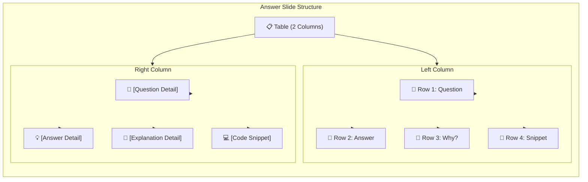
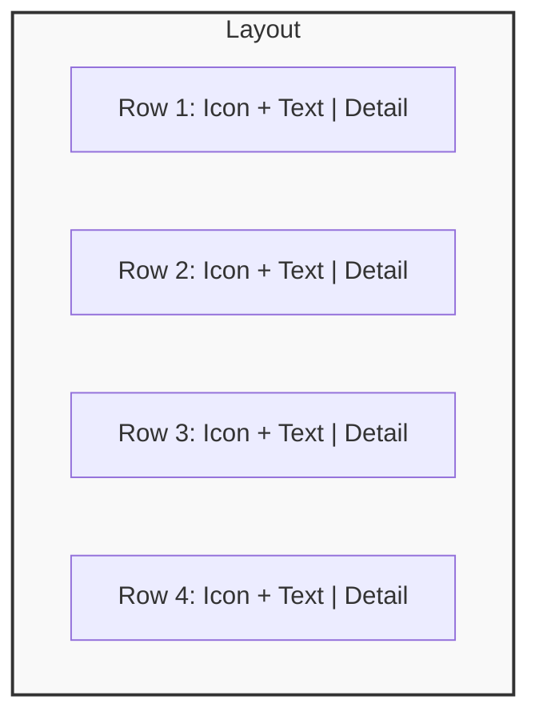

http://127.0.0.1:8080/05-02-2026-Gold-Infographic-B1/#/3http://127.0.0.1:8080/05-02-2026-Gold-Infographic-B1/#/3by 20# Answer Slide Layout Architecture

## Visual Structure Diagram



---

## Grid Layout Specification



---

## HTML Template Pattern

```html
<table class="answer-table">
    <!-- Row 1: Question -->
    <tr>
        <td class="icon-cell">
            <i class="fas fa-question-circle"></i>
            <p>Question</p>
        </td>
        <td class="detail-cell">[Question]</td>
    </tr>
    
    <!-- Row 2: Answer -->
    <tr>
        <td class="icon-cell">
            <i class="fas fa-lightbulb"></i>
            <p>Answer</p>
        </td>
        <td class="detail-cell">[Answer]</td>
    </tr>
    
    <!-- Row 3: Why? -->
    <tr>
        <td class="icon-cell">
            <i class="fas fa-search"></i>
            <p>Why?</p>
        </td>
        <td class="detail-cell">[Explanation]</td>
    </tr>
    
    <!-- Row 4: Snippet -->
    <tr>
        <td class="icon-cell">
            <i class="fas fa-code"></i>
            <p>Snippet</p>
        </td>
        <td class="detail-cell"><pre><code>[Snippet]</code></pre></td>
    </tr>
</table>
```

---

## CSS Styling

```css
.answer-table {
    width: 100%;
    border-collapse: collapse;
}

.icon-cell {
    width: 25%;
    text-align: center;
    vertical-align: top;
    padding: 15px;
    background: rgba(0,0,0,0.2);
}

.icon-cell i {
    font-size: 2em;
    display: block;
    margin-bottom: 10px;
}

.detail-cell {
    width: 75%;
    padding: 15px;
    vertical-align: top;
}
```

---

## Layout Preview

```
┌─────────────────────────┬────────────────────────────────────────┐
│ 🔷 Question             │ [What is the capital of France?]       │
├─────────────────────────┼────────────────────────────────────────┤
│ 🔷 Answer               │ [Paris]                                 │
├─────────────────────────┼────────────────────────────────────────┤
│ 🔷 Why?                 │ [Explanation text...]                   │
├─────────────────────────┼────────────────────────────────────────┤
│ 🔷 Snippet              │ [Code/Example]                          │
└─────────────────────────┴────────────────────────────────────────┘
```

---

## Use Cases

- **Quiz Answer Slides**: Display question + answer pair
- **Vocabulary Slides**: Word + definition + example + usage
- **Concept Explainer**: Problem + solution + explanation + demo
- **Code Tutorial**: Challenge + solution + rationale + snippet

---

## Color Coding (Optional)

| Row | Color | Icon | Purpose |
|-----|-------|------|---------|
| Question | 🔵 Blue | `fa-question-circle` | Challenge/Problem |
| Answer | 🟢 Green | `fa-lightbulb` | Solution |
| Why? | 🟡 Yellow | `fa-search` | Explanation |
| Snippet | 🟣 Purple | `fa-code` | Example/Code |
