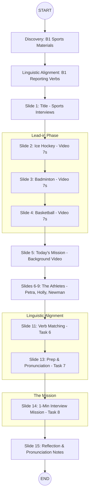

# Visual Plan - Sports Interviews (B1 Speaking)

### Key Pedagogical Hooks:
- **Lead-in**: 7s burst videos for rapid engagement.
- **Mission**: Explicit "Today's Mission" slide with background video.
- **Scaffolding**: Strategy slide (Interviewer's Craft) before the big mission.
- **Anti-Echo**: Quote matching requires rephrasing internal thought to reporting verbs.
