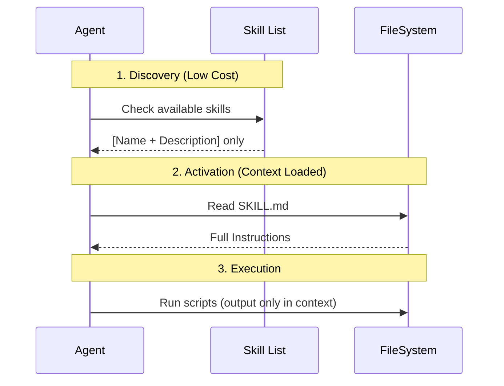

# Agent Skills System (Antigravity)

> **Standard**: [Agentskills.io Open Standard](https://agentskills.io/home)  
> **Last Updated**: 2026-01-14

## 1. What Are Skills?

Skills are modular, filesystem-based packages of knowledge that extend an agent's capabilities. They transform a generalist agent into a specialist for specific tasks.

**Core Properties:**
- **Modular**: Each skill is a self-contained unit.
- **Filesystem-Based**: Skills exist as directories navigated via standard commands.
- **Progressive Disclosure**: Loads only necessary information to conserve context.

---

## 2. Storage Locations (Antigravity-Specific)

| Scope | Path | Use Case |
| :--- | :--- | :--- |
| **Workspace** | `<workspace-root>/.agent/skills/<skill>/` | Project-specific workflows (CI/CD, testing). |
| **Global** | `~/.gemini/antigravity/skills/<skill>/` | Universal utilities for all projects. |

---

## 3. Progressive Disclosure Lifecycle



| Level | Content | Loaded When | Token Cost |
| :--- | :--- | :--- | :--- |
| **1** | Metadata (name, description) | Startup | ~100 tokens/skill |
| **2** | `SKILL.md` Instructions | Task Match | < 5k tokens |
| **3** | Resources (`REFERENCE.md`, scripts) | As Needed | Zero until read |

---

## 4. Skill Structure

```text
my-skill/
├── SKILL.md           # [MANDATORY] Entry point with frontmatter + instructions
├── REFERENCE.md       # [Optional] API refs, schemas, data tables
├── scripts/           # [Optional] Executable tools
│   └── validate.py
└── examples/          # [Optional] Reference implementations
```

### `SKILL.md` Frontmatter

```yaml
---
name: my-skill-name    # Optional (defaults to folder name). Lowercase, hyphens.
description: Generates unit tests for Python using pytest.  # REQUIRED. Third-person, keyword-rich.
---
```

---

## 5. Authoring Best Practices

### Design Principles
| Principle | Do | Don't |
| :--- | :--- | :--- |
| **Single Responsibility** | One skill = one task. | "God Skills" that do everything. |
| **Conciseness** | `SKILL.md` < 500 lines. | Embed all reference material inline. |
| **Third-Person Descriptions** | "Generates X" | "I will generate X" |
| **Keyword-Rich Triggers** | Include terms users will say. | Vague descriptions. |

### Implementation
- **Deterministic Scripts**: Prefer `validate.py` over LLM reasoning for accuracy.
- **Black Box Scripts**: Instruct agent to run with `--help` first, not read source.
- **Decision Trees**: For complex skills, add "How to choose" sections.
- **Validators**: Always run validators immediately after making changes.

### Naming Conventions
- Use **gerund form**: `processing-pdfs`, `analyzing-spreadsheets`.
- **Avoid**: `utils`, `helper`, `files`.

---

## 6. Workflow: Using a Skill

1. **Check Metadata**: Does the request match a skill description?
2. **Trigger**: Read `SKILL.md` via `cat skills/<skill>/SKILL.md`.
3. **Assess**: Need more detail? Read `REFERENCE.md`. Need action? Run scripts.
4. **Execute**: Follow instructions, validate output.

---

## 7. Security

- **Trusted Sources Only**: Skills can execute code.
- **No "Magic"**: Rely strictly on provided tools/scripts.
- **Progressive Disclosure**: Don't read every file immediately.

---

## 8. Quick Reference Checklist

- [ ] **Description**: Specific, third-person, includes trigger keywords.
- [ ] **Conciseness**: `SKILL.md` < 500 lines.
- [ ] **Structure**: References are 1 level deep (no nested linking).
- [ ] **Scripts**: Robust error handling; run with `--help` guidance.
- [ ] **Tested**: Verified with intended models.
