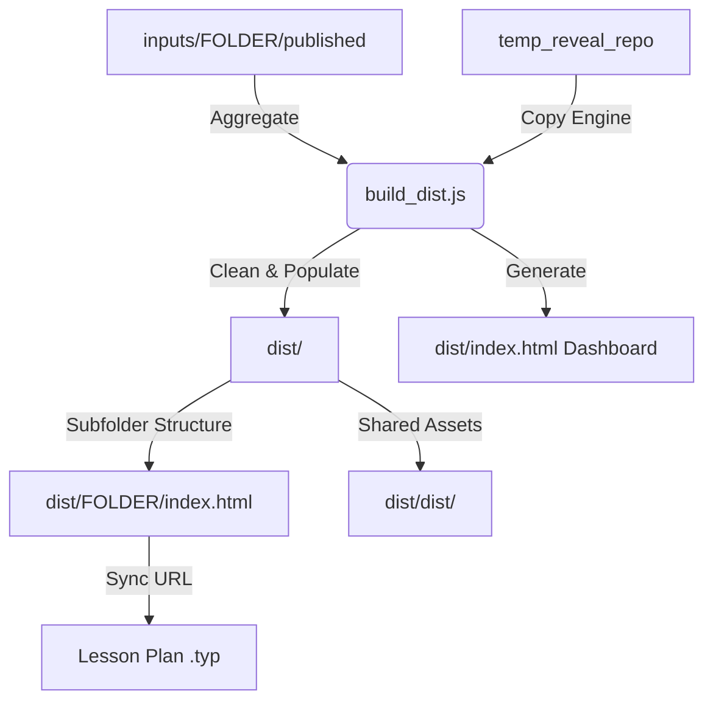

# Skill: Deploying to GitHub Pages (`deploying-to-github-pages`)

## Description
This skill automates the process of building a production-ready `dist/` directory and preparing it for GitHub Pages deployment. It enforces the "Zero Overwrite" architecture where each lesson lives in its own subfolder and shares a single root-level Reveal.js engine.

## Core Mandates
1.  **Repo Hygiene**: NEVER commit heavy media (>1MB) to both `inputs/` and `dist/`. Build scripts must handle assets according to the Global Asset Pattern.
2.  **Zero Overwrite**: Every presentation must reside in its own unique subfolder (e.g., `https://elwrush.github.io/actions-gh-pages/lesson-name/`).
3.  **Single Engine**: All presentations reference the shared Reveal.js engine at the parent level (`../dist/`, `../plugin/`).
4.  **Automatic Sync**: After a build, the live URL MUST be synchronized back to the Typst lesson plan.

## Architectural Overview



## Workflow

### 1. Build
Run the build script to aggregate all presentations and the shared engine into the root `dist/` folder:

```powershell
node scripts/build_dist.js
```

The script will:
- Clear the current `dist/` folder.
- Copy the Reveal.js engine (`dist/`, `plugin/`, `css/`) from `temp_reveal_repo` to `dist/`.
- Scan `inputs/` for folders containing `index.html`.
- Copy each into `dist/[folder-name]/`.
- **Fix Paths**: Automatically update `index.html` to reference `../dist/` and `../plugin/`.
- Generate a dashboard at `dist/index.html`.

### 2. Synchronize URL
Update the Typst lesson plan with the live URL:

```powershell
python skills/deploying-to-github-pages/scripts/sync_lesson_plan_url.py [FOLDER-NAME]
```

### 3. Verify
- Open `dist/index.html` locally to check the dashboard and links.
- Run the validator: `python .gemini/hooks/present-validator.py inputs/[FOLDER-NAME]/presentation.json`.

### 4. Commit & Push (Manual Gate)
Ask the user for approval before committing:
> "The build is complete and verified. Shall I commit and push to GitHub Pages?"

If approved:
```powershell
git add dist/
git commit -m "feat(deploy): publish [FOLDER-NAME] to GitHub Pages"
git push origin main
```

## Troubleshooting

### 404 Errors on Engine Assets
Check the `index.html` in the deployed subfolder. Ensure paths like `href="../dist/reveal.css"` are correct and that the `dist/` folder exists at the root of the repository.

### Broken Dashboard Links
Ensure the `FOLDER-NAME` in the dashboard matches the actual folder in `dist/`. The `build_dist.js` handles this automatically by scanning the `inputs/` directory.

## Live URL Pattern
- **Base URL**: `https://elwrush.github.io/actions-gh-pages/`
- **Presentation**: `https://elwrush.github.io/actions-gh-pages/[FOLDER-NAME]/`
