# Skill: Deploying to GitHub Pages (`deploying-to-github-pages`)

## Description
This skill automates the deployment of Reveal.js Presentations to GitHub Pages. It uses a **clean-build strategy**:
1.  Source materials (`inputs/`) live in the `main` branch.
2.  The build script (`scripts/build_dist.js`) extracts ONLY web assets into a temporary `dist/` folder.
3.  GitHub Actions builds and pushes `dist/` to a separate `gh-pages` branch.
4.  **Only the contents of `dist/` are visible on the live website.**

## Critical Rules

> [!CRITICAL]
> **HYGIENE MANDATE**: Never commit the `dist/` folder to the `main` branch. It is excluded via `.gitignore`. The live site is built automatically by GitHub Actions upon pushing to `main`.

> [!CRITICAL]
> **ONLY PRESENTATIONS**: The build script is whitelisted. It will NEVER copy `.typ`, `.pdf`, `.json` (config), or `.py` files to the deployment folder.

> [!IMPORTANT]
> **REPOSITORY**: The target repository is `https://github.com/elwrush/actions-gh-pages`.
> **LIVE URL**: `https://elwrush.github.io/actions-gh-pages/[FOLDER-NAME]/`

## Architectural Workflow

```mermaid
graph TD
    Start([🚀 Deployment Request]) --> Build[1. Local Build & Validate: npm run build]
    Build --> Commit[2. Commit Source to main: /commit]
    Commit --> Push[3. Push to GitHub]
    
    subgraph GitHub_Actions [CI/CD Pipeline]
        Push --> Action[Trigger: deploy.yml]
        Action --> RemoteBuild[npm run build]
        RemoteBuild --> Deploy[peaceiris/actions-gh-pages]
        Deploy --> Publish[Update gh-pages branch]
    end
    
    Publish --> Sync[4. Sync Live URL to .typ Plan]
    Sync --> Finish([🏁 Live Slideshow & Updated Plan])
```



## Workflow Steps

### 1. Build & Validate (Local)
Prepare the `dist/` directory and ensure no source materials leaked in.
// turbo
```powershell
npm run build; python scripts/validate_dist_hygiene.py
```

### 2. Commit & Push Source
Commit your changes (JSON, Typst, etc.) to the `main` branch.
```bash
/commit "feat: update [Lesson Name] and prepare for deployment"
```
*Note: This triggers the GitHub Action.*

### 3. Synchronize Lesson Plan URL (CRITICAL)
Once the action completes (usually 1-2 minutes), update your Typst file with the finalized live URL.
// turbo
```powershell
python skills/deploying-to-github-pages/scripts/sync_lesson_plan_url.py "inputs/[FOLDER]/[FILENAME].typ" "https://elwrush.github.io/actions-gh-pages/[FOLDER]/"
```

## Troubleshooting

### "Materials appearing on site"
1. Run `python scripts/validate_dist_hygiene.py` locally.
2. Check `scripts/build_dist.js` whitelists.
3. Ensure `dist/` is NOT tracked in git: `git rm -r --cached dist`.

### "404 Not Found"
1. Verify the folder name in `inputs/` matches the URL.
2. Check GitHub Actions tab for build failures.
3. Ensure `index.html` exists in `inputs/[FOLDER]/published/`.