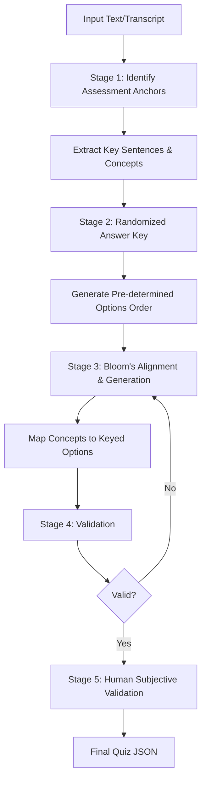

# Generating Quizzes

This skill automates the creation of high-quality, pedagogically sound assessments from reading and listening texts. It uses a structured multi-stage approach inspired by the `Questgen.ai` framework to ensure cognitive depth and plausible distractors.

## Workflow

1.  **Define Parameters**:
    -   **Source Content**: Reading text or Listening transcript.
    -   **CEFR Level**: Target difficulty (A1-C2).
    -   **Question Types**: Choose from the 12 types in [REFERENCE.md](file:///c:/PROJECTS/LESSONS%20AND%20SLIDESHOWS%202/skills/generating-quizzes/REFERENCE.md).
    -   **Bloom's Levels**: Specify target cognitive levels (e.g., "Understanding", "Analyzing").
    -   **CRITICAL INTERACTION**: The agent MUST present these options as an **enumerated menu** to the user to confirm the "Assessment Blueprint" before proceeding.

2.  **Generate Answer Key**:
    -   **CRITICAL**: Generate a randomized sequence of correct answer positions (e.g., [1, 0, 3, 2...]) *before* generating the questions. This prevents predictable answer patterns.

3.  **Generate Content**:
    -   Apply the multi-stage prompt series in [REFERENCE.md](file:///c:/PROJECTS/LESSONS%20AND%20SLIDESHOWS%202/skills/generating-quizzes/REFERENCE.md).
    -   Match the correct answer for each question to the pre-generated Answer Key position.
    -   **Constraint**: Every question must be grounded in an "Assessment Anchor" from the text.

4.  **Validate Structure**:
    -   Run `python scripts/validate_quiz.py [path_to_json]`.
    -   **Requirements**: Exactly 4 choices for MCQs, 0-indexed answers, and pedagogical explanations.

5.  **Human Subjective Validation**:
    -   Perform a final quality check as a "human validator." Assess distractor plausibility, narrative flow, and CEFR alignment.

## Design Standards

-   **Plausible Distractors**: Distractors must be semantically related to the correct answer but factually incorrect based on the text.
-   **No Ordinals**: Choices must not contain "A)", "1.", etc.
-   **Bloom's Taxonomy**: Questions should range from "Remembering" to "Evaluating" based on task requirements.

## Troubleshooting

-   **Hallucination**: If questions reference information not in the text, reinforce the "Assessment Anchor" constraint in the prompt.
-   **Predictable Answers**: Ensure "Answer Mention Order" is varied (don't always make 'C' the correct answer).
