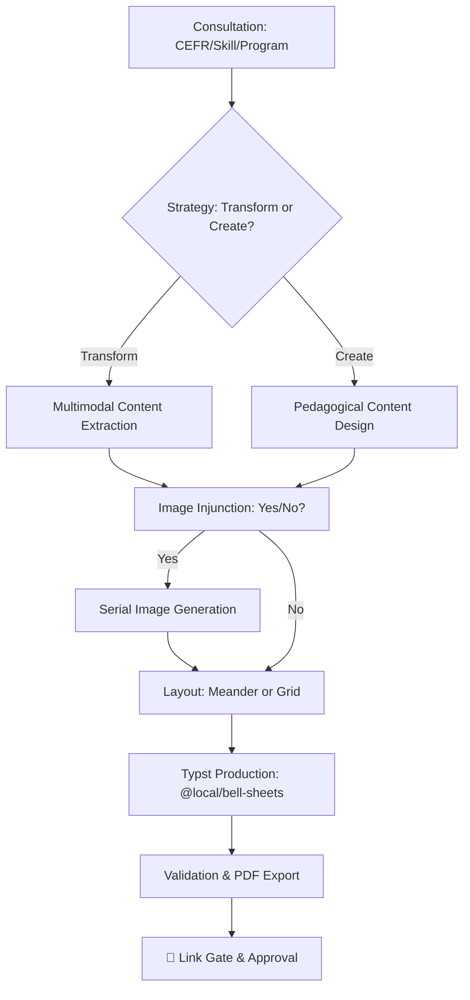

# Producing Educational Materials

## Purpose
Guide the transition from raw educational requirements to print-ready, professionally branded PDF worksheets. Consolidates pedagogical design with high-density Typst production.

## Workflow Visualization


---

## Workflow

### Step 1: Requirements Gathering & Consultation
You MUST consult with the user on these core constraints:
- **CEFR Level**: A1-C2 (mandatory).
- **Skill/System**: Reading, Listening, Writing, Speaking, Grammar, Vocabulary, or Pronunciation.
- **Duration**: Target lesson length.
- **Program Selection**: **CRITICAL**. Prompt user to choose between **Bell** and **Intensive**. 
  - *Assets Location*: Branded straps are found in `@local/bell-sheets:0.1.0/images/`.
- **Image Choice**: Prompt user: *"Would you like to include custom images/illustrations for this worksheet?"*

### Step 2: Image Strategy (If 'Yes')
Images must be handled with precision:
- **Serial Production**: Generate images **one at a time** (sequentially) to ensure relevance and quality. DO NOT batch generate.
- **Source Priority**:
  1. **Internal**: Use `generate_image` tool first for custom styles.
  2. **Pixabay**: Use the `searching-pixabay` skill if internal generation fails to meet requirements.

### Step 3: Content Strategy
Determine if you are **transforming existing materials** (use multimodal extraction) or **writing brand new content**.

### Step 4: Design Strategy (Editorial Standard)
Apply the **Creative/Editorial** approach to maximize engagement and density:
1. **High Density**: Use 2-column grids for long texts.
2. **Cinematic Headers**: Use full-width banners with overlay text (max height 4-5cm).
3. **Immersive Wrappers**: Use thematic containers (e.g., "Tablet UI" for digital texts).

### Step 5: Typst Production (Global Components)
All worksheets MUST use the global `@local/bell-sheets:0.1.0` package.

**MANDATORY IMPORT**:
```typst
#import "@local/bell-sheets:0.1.0": *
```

#### Layout & Production Rules:
- **Duplex Printing**: Worksheets are often printed 2-up Double Sided.
  - **Handwriting Space**: Use **1.1cm** minimum vertical spacing for all rule lines (`#writing_lines_dynamic(line-spacing: 1.1cm)`).
  - **Font Size**: Minimum **11pt** for body text.
- **Identity Blocks & Writing Tasks**:
  - **Separate Page**: **CRITICAL**. Writing tasks and their associated `identity_block_sat()` MUST always be placed on a **separate new page**. Use `#pagebreak()` before the block.
  - **Usage**: Insert ONLY when written critical thinking or written responses are required.
  - **Contrast**: Ensure white interiors within boxes for high-contrast photocopies.
- **Images & Wrapping**:
  - **Meander**: Use the `using-meander` skill for complex text wrapping around images.
  - **Simplicity**: If Meander fails, use 2-column grids for side-by-side layouts.

#### Branding Rules:
- **Bell**: Use `bell_header()` and `hero_strap(...)`.
- **Intensive**: Use `intensive_header()` and standard photographic straps.
- **NEVER** use legacy maroon straps or local component copies.

#### Layout Rules:
- **Rule Lines**: Use `writing_lines_dynamic()` for space-filling or `writing_lines_fixed(count)` for specific areas. Dark gray (`#333333`) is mandatory.
- **Badges**: Use `badge("TEXT")` for headers and task markers. Refined for legibility and contrast.
- **Orphan Prevention**: Wrap every Task header in a `#block(breakable: false)`.

### Step 6: Rendering & Validation
1. **Compile**:
   ```powershell
   typst compile "path/to/source.typ" "outputs/DD-MM-YYYY-[LEVEL]-[TITLE].pdf" --root "."
   ```
2. **Validate**:
   ```powershell
   python scripts/validate_worksheet.py "path/to/source.typ" --mode [bell|intensive]
   ```

### Step 7: 🏁 THE LINK GATE
> [!CRITICAL]
> **YOU MUST PROVIDE A CLICKABLE LINK TO THE PDF.**
> Post the link using the `file:///` protocol. Do NOT proceed until the user approves the visual output.

---

## Reference Material
- **Global Docs**: `~/.gemini/antigravity/skills/producing-educational-materials/REFERENCE.md` (Coming Soon)
- **Shared Components**: `@local/bell-sheets:0.1.0/lib.typ`
