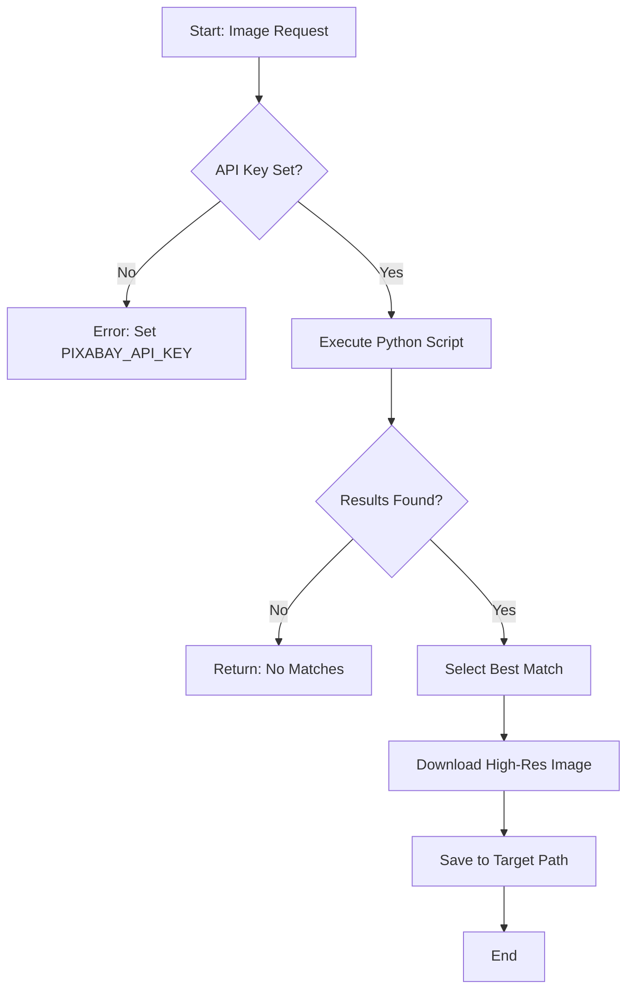

# Searching Pixabay

## Description
This skill downloads images from Pixabay using the official API. It requires a valid `PIXABAY_API_KEY` environment variable.

## Setup
1.  **API Key**: Ensure `PIXABAY_API_KEY` is set in the User environment variables.
2.  **Validation**: The script checks for the key before execution.

## Visual Process


## Workflow

### 1. Usage
Run the Python script with a query and output path:

```powershell
python skills/searching-pixabay/scripts/download_image.py --query "cat sitting on wall" --output "inputs/Lesson1/cat.jpg" --type [photo|illustration]
```

### 2. Arguments
- `--query`: Search terms (be specific).
- `--output`: Full path to save the image (must include `.jpg` or `.png` extension).
- `--type`: (Optional) `photo` (default) or `illustration`.
- `--orientation`: (Optional) `horizontal` (default) or `vertical`.

### 3. Verification
- Check the file size of the downloaded image (should be > 0 bytes).
- Verify it is a valid visual asset.
- **For Videos**: Check `inputs/[Lesson]/images/` for the `.mp4` file.

### 4. Video Usage (New)
To download stock footage (e.g., backgrounds):
```powershell
python skills/searching-pixabay/scripts/download_video.py --query "soldiers mission" --output "inputs/Lesson1/images/vid.mp4" --type [film|animation]
```
- **Note**: Downloads high-quality (HD/FHD) MP4s.

## Troubleshooting
- **403 Forbidden**: Check API Key.
- **503/429**: API limit reached (wait and retry).
- **No Results**: Try broader search terms.
