# Writing Lesson Plans

This skill guides you through an 8-step interactive workflow to create a lesson plan.

## Prerequisites

- Access to `knowledge_base/shapes/` directory for modular shape definitions
- Materials in `/inputs` subfolder (or user will design new materials)

## Visual Process

```mermaid
graph TD
    Start([LP Request]) --> Shape{1. Shape Selection}
    Shape -->|A-J| Metadata[2. Collect Metadata]
    Metadata --> Type{3. Lesson Type}
    
    Type -->|Bell| HeaderBell[bell-header.jpg]
    Type -->|Intensive| HeaderInt[intensive-header.jpg]
    
    HeaderBell & HeaderInt --> Source{4. Materials Source}
    Source -->|New| H[Design Materials]
    Source -->|Existing| I[Scan Source Inputs]
    
    H & I --> Clarify[5. Clarify Materials]
    Clarify --> Special[6. Special Requests]
    Special --> Suggest[7. Suggest Objective]
    
    Suggest --> Align{Linguistic Alignment}
    Align --> Write[8. Write Typst Plan]
    
    Write --> Validate{9. Validate}
    Validate -->|Fail| Fix[Fix Plan]
    Fix --> Write
    
    Validate -->|Pass| ApproveLP{Gate 1: LP Approval?}
    ApproveLP -->|Fail| Fix
    
    ApproveLP -->|Pass| Slideshow[Generate Slideshow]
    Slideshow --> ApproveSlides{Gate 2: Slideshow Approval?}
    
    ApproveSlides -->|Fail| Slideshow
    ApproveSlides -->|Pass| Automate[10. Post-Generation Automations]
    
    Automate --> Finish([🏁 Final PDF & Live Slideshow])
```



## Workflow

### Step 1: Present Lesson Shape Menu

Load shapes from `knowledge_base/shapes/` directory and present:

```
Which lesson shape would you like to use?

A. Text-based presentation of language
B. Language Practice
C. Test-Teach-Test (TTT)
D. Situational Presentation (PPP)
E. Receptive Skills (Reading/Listening - Traditional)
F. Productive Skills (Speaking/Writing - Traditional)
G. Task-Based Learning (TBL)
H. SCR Receptive Skills (Reading/Listening - Storytelling Framework)
I. SCR Systems (Grammar/Vocabulary - Storytelling Framework)
J. SCR Productive Skills (Speaking/Writing - Message Structure)
```

### Step 2: Collect Lesson Metadata

Ask for:
- **CEFR Level**: A1, A2, B1, B2, C1, C2
- **Focus**: Systems (Grammar/Vocabulary/Pronunciation) or Skills (Reading/Writing/Listening/Speaking)
- **Teacher Name**: Defaults to **Ed Rush** (Always use this unless specified otherwise)
- **Duration**: Total lesson time in minutes
- **Textbook/Unit**: If using coursebook
- **Page Numbers**: Relevant pages
- **Assessment Type**: CA (Continuous Assessment), formal test, or n/a

### Step 3: Lesson Type

Ask:
> "Is this an **Intensive** or **Regular Bell** lesson?"

This determines which header image to use:
- **Intensive**: `intensive-header.jpg`
- **Regular Bell**: `bell-header.jpg` (or appropriate regular header)

### Step 4: Materials Source

Ask:
> "Will you be designing new materials (separate skill) or using pre-existing materials?"

If pre-existing:
1. List subfolders in `/inputs`
2. Ask user to select one
3. Note: Actual file scanning uses a separate multimodal skill

### Step 5: Clarify Materials

If materials are unclear, ask specific questions:
- What is the main topic/context?
- What target language items are covered?
- Are there audio/video components?
- Are there exercises with answer keys?

### Step 6: Special Requests and Notes

Before generating the lesson plan, ask:
> "Do you have any special requests or notes for this lesson? (e.g., include a YouTube video, emphasize particular exercises, specific activities, time constraints, student needs)"

Wait for user response and incorporate their requests into the lesson plan.

### Step 7: Suggest Objective + Marker Sentences

Based on collected information:

1. **Propose lesson objective** using format:
   > "By the end of the lesson, learners will be better able to [skill/language point] in the context of [topic]."

2. **Suggest marker sentences** (for shapes A, B, C, D):
   > Example sentences containing target language for clarification stages.

Wait for user approval before proceeding.

### Step 7.5: Procedural Density Gate (MANDATORY)
**Goal**: Prevent truncated procedures.
Before writing any code, you **MUST** present a detailed Markdown summary of the lesson procedure. 
- **Requirement**: Each stage must have at least 3-5 bullet points of granular teacher actions.
- **Markers**: Include specific elicitation questions (e.g., "Elicit: What does the symbol /ə/ look like?") and interaction patterns (T-S, S-S).
- **STOP AND WAIT**: Do not proceed until the user says "Approved" or "Expand Stage X".

### Step 8: Write Lesson Plan (Typst Format)

Generate the lesson plan **in Typst format** for professional PDF output. Use the standardized component library.

> [!CRITICAL]
> **GATE 1: LESSON PLAN APPROVAL**
> You MUST present the generated lesson plan (or a clean markdown summary) to the user and wait for EXPLICIT APPROVAL before proceeding to any subsequent steps (such as slideshow generation).

> [!IMPORTANT]
> **Output Format**: Typst (`.typ`) files compiled to PDF using the `compiling-typst-docs` skill.
> - Typst provides version control, reusability, and consistent branding.
> - **Template Import**: Always import the components at the top:
>   `#import "../../skills/writing-lesson-plans/templates/lesson-plan-components.typ": *`

#### File Naming & Location Discipline
**Canonical Folder:** `inputs/[DD-MM-YYYY-Topic-Level]/`

Store ALL files in this folder using strict sub-directories:
- **Lesson Plan Source:** `inputs/[Folder]/published/[DD-MM-YYYY]-LP-and-slideshow-[Level]-[Topic]-[Shape].typ`
- **Local PDF:** `inputs/[Folder]/published/[DD-MM-YYYY]-LP-and-slideshow-[Level]-[Topic]-[Shape].pdf`
- **Images:** `inputs/[Folder]/images/`
- **Audio:** `inputs/[Folder]/audio/`
- **Quizzes:** `inputs/[Folder]/quizzes/`
- **Presentations (JSON/HTML):** `inputs/[Folder]/`

> [!CRITICAL]
> **NO WEB PDFS**: The PDF lesson plans are **Local Artifacts** for printing and offline reference ONLY. They **MUST NEVER** be pushed to GitHub Pages or included in the `dist/` folder. The web distribution is for interactive slideshows only.
> **NO VERSIONING**: Never create versioned filenames (e.g., `lesson-plan-v2.typ`, `lp-FINAL.pdf`). Always **OVERWRITE** the original canonical file. Version history is handled by Git, not by filenames.
> **NO ROOT FILES**: Never save files to the `inputs/` root or the Project root. Always use the named subfolder.
> **NO SCATTERING**: Do not create generic folders like `temp_quiz_repo`. Use the `published/` or `quizzes/` subfolder as appropriate.

#### Typst Structure

**Template Boilerplate:**

```typst
#import "../../skills/writing-lesson-plans/templates/lesson-plan-components.typ": *

#set page(paper: "a4", margin: (top: 1.5cm, bottom: 2cm, x: 2cm))
#set text(font: "Arial", size: 10pt, fill: rgb("#333333"))
#set par(leading: 0.65em, justify: false)

#lesson_header("[bell or intensive]")

#metadata_table((
  teacher: "Ed Rush",
  date: "[DD-MM-YYYY]",
  cefr: "[Level]",
  duration: "[XX Minutes]",
  shape: "[X (Name)]",
  assessment: "[N/A or CA]",
  focus: "[Focus]",
  materials: "[filename].pdf",
))

#v(0.5cm)

#main_aim_box[
  By the end of the lesson, learners will have practiced...
]

#v(0.5cm)

#differentiation_box[
  ...
]

// MANDATORY: Slideshow link MUST be placed here, after the differentiation box and before the stages
#v(0.5cm)
#slideshow_link("https://elwrush.github.io/lesson-plan-agent/[FOLDER-NAME]/")

#v(0.5cm)

#stage_table((
  stage("ONE", "Lead-in", "8", "To activate schema...", [
    - Procedure point 1...
    - Procedure point 2...
  ], "T-Ss / Ss-Ss"),
))
```

#### 🔍 MANDATORY: Review & Polish

Before finalizing the plan, you **MUST** conduct a self-evaluation:

1.  **Consult the Model**: Open `knowledge_base/shapes/shape-[letter].yaml`.
2.  **Evaluate Detail**: Does your procedure have the same level of granular detail as the `example_lesson_plan` in the model?
3.  **No Slide References**: **STRICTLY BANNED**. Never refer to specific slide numbers (e.g., "Show Slide 4", "Refer to Slide 12") in the procedure. This language is mechanical and non-pedagogical. Instead, refer to the *content* or *purpose* (e.g., "Show the Lead-in visual," "Display the Task 1 sentences").
4.  **Correct Truncation**: Expand procedures with specific pedagogical steps if they look too brief.
4.  **🔍 CHECK FOR ORPHANS**: Ensure no "Stage Header" (maroon row) is left alone at the bottom of a page. 
    - **To Fix**: If a Stage Header is orphaned, split the `stage_table` into two separate calls and insert `#pagebreak()` between them in the `.typ` file.
5.  **Verification**: You will be judged on whether the lesson plan feels as "thick" and professional as the model.

#### 🧪 Step 9: Validate (MANDATORY)
Run the validators before finalizing:
1. **Consistency**: `python skills/writing-lesson-plans/scripts/validate_lesson_plan.py [path] --mode [bell|intensive]`
2. **Density**: `python skills/writing-lesson-plans/scripts/validate_lp_density.py [path]`

- **Rule**: If either script fails, fix the issues and re-run until it passes.

> [!CRITICAL]
> **GATE 2: POST-VALIDATION CHECK**
> Once the plan passes validation, confirm with the user one final time: "The lesson plan is validated and ready. Shall I proceed to generate the slideshow/materials?"

### Step 10: Post-Generation Automations

After the lesson plan is validated and approved, perform the following automations:

1.  **Generate Slideshow**:
    Follow the `creating-html-presentation` skill.
    > [!CRITICAL]
    > **GATE 3: SLIDESHOW APPROVAL**
    > The slideshow MUST be reviewed by the user (using `Start-Process`) and EXPLICITLY APPROVED before it is built into the dashboard or uploaded to GitHub Pages.

2.  **Build Slideshow Dashboard**:
    Run the build script ONLY after the slideshow is approved:
    ```powershell
    node scripts/build_dist.js
    ```
3.  **Deployment Reminder**:
    Explicitly tell the user:
    > "I've updated the slideshow library. Please **push your changes to GitHub** to trigger the live deployment to GitHub Pages (assuming the slideshow has been approved for production)."

3.  **URL Reporting**:
    Provide the user with the direct link to the slideshow:
    `https://elwrush.github.io/lesson-plan-agent/[FOLDER-NAME]/`

#### Pre-teach Vocabulary Format (Shape E)

Select **5 words** from the source text.

```
### 1. word /phonetic/: English context sentence (implies meaning).
// NOTE: Thai translations are BANNED - use only English context sentences.
```

---

## Reference Files

- [REFERENCE.md](REFERENCE.md) - Shape summaries
- [knowledge_base/shapes/](file:///c:/PROJECTS/LESSONS%20AND%20SLIDESHOWS%202/knowledge_base/shapes/) - Complete shape definitions
